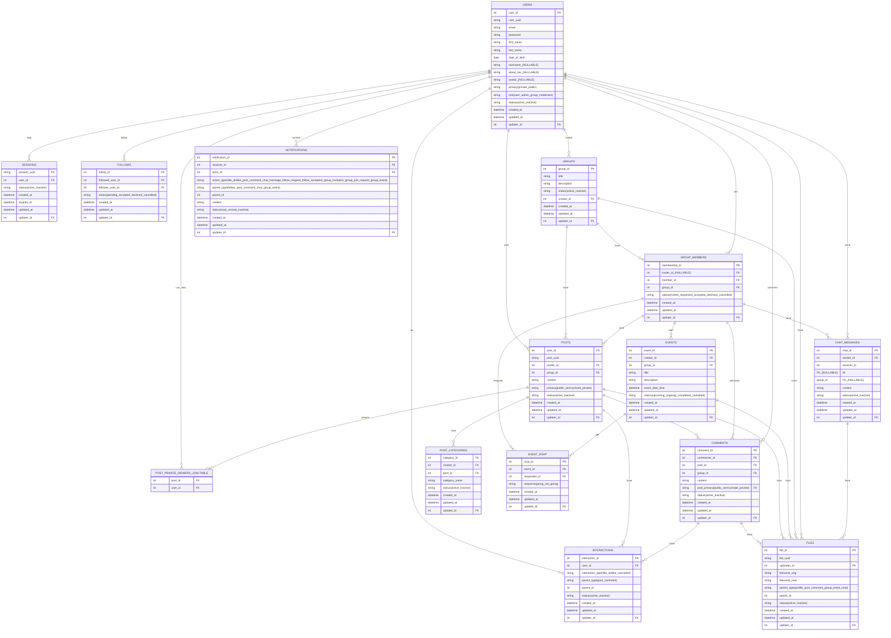

# Social Network

A Facebook-like social network application with authentication, profiles, posts, groups, notifications and chat functionality.

## Quick Start

We've included a setup script to get you up and running quickly:

```bash
# Make the setup script executable
chmod +x setup.sh

# Run the setup script
./setup.sh
```

This script will do the following:

1. Check for required dependencies (Node.js v14+ for frontend, Go v1.21+ for backend)
2. Install necessary packages for both frontend and backend
3. Set up the database with initial migrations
4. Create necessary directories and configuration files
5. Provide instructions for starting the applications

### Run the Program Locally

There is a Makefile that can run on Mac/Linux:

```bash
# Start both backend and frontend (from project root)
make start

# Stop all running services
make stop
```

### Run the Program on Docker

We provide a script to build and run the application using Docker:

```bash
# Make the script executable (if not already)
chmod +x docker.sh

# Start the backend and frontend containers
./docker.sh
```

This script will do the following:

- Stop and remove any existing containers (`social-network-backend`, `social-network-frontend`)
- Prune unused containers and images to free up space
- Build Docker images with tags `social-network:backend` and `social-network:frontend`
- Start both containers with proper networking
- Set up volume mounts for database persistence

**Managing containers:**
```bash
# Stop containers
docker-compose down

# View container logs
docker logs social-network-backend
docker logs social-network-frontend

# View running containers
docker ps
```

## Manual Setup

If you prefer to set up manually, follow these steps:

### Prerequisites

**Required:**
- **Node.js** (v14.0.0 or newer) and npm – required for the Next.js frontend
- **Go** (v1.21 or newer) – required for the backend API
- **SQLite3** – database engine (usually pre-installed on Mac/Linux)

**Optional:**
- **Docker & Docker Compose** – if you prefer containerized deployment
- **Make** – for using the Makefile commands

**Verify installations:**
```bash
node --version    # Should show v14.0.0 or higher
npm --version     # Should show 6.0.0 or higher  
go version        # Should show go1.21 or higher
sqlite3 --version # Should show SQLite3 version
```

### Frontend Setup (Next.js)

```bash
npm install
npm run dev
```

The frontend will be available at `http://localhost:3000`

### Backend Setup (Go)

```bash
cd backend

# Start the backend server
go run main.go
```

The backend will be available at `http://localhost:8080`

## Project Structure

- `root` - React-based frontend application
- `/backend` - Go backend API server
- `/backend/db` - SQLite database and migrations
- `/backend/main.go` - Backend entry point

## Features

- User authentication with sessions
- User profiles with privacy settings
- Posts with privacy controls
- Groups and events
- Real-time notifications
- Private and group chat
- Follower system

## Technology Stack

- **Frontend**: Next.js, React
- **Backend**: Go, Gorilla Websockets, SQLite3
- **Database**: SQLite with migrations
- **Authentication**: Session-based with secure cookies

## Database Schema

See the Entity-Relationship Diagram below:

### ERD


