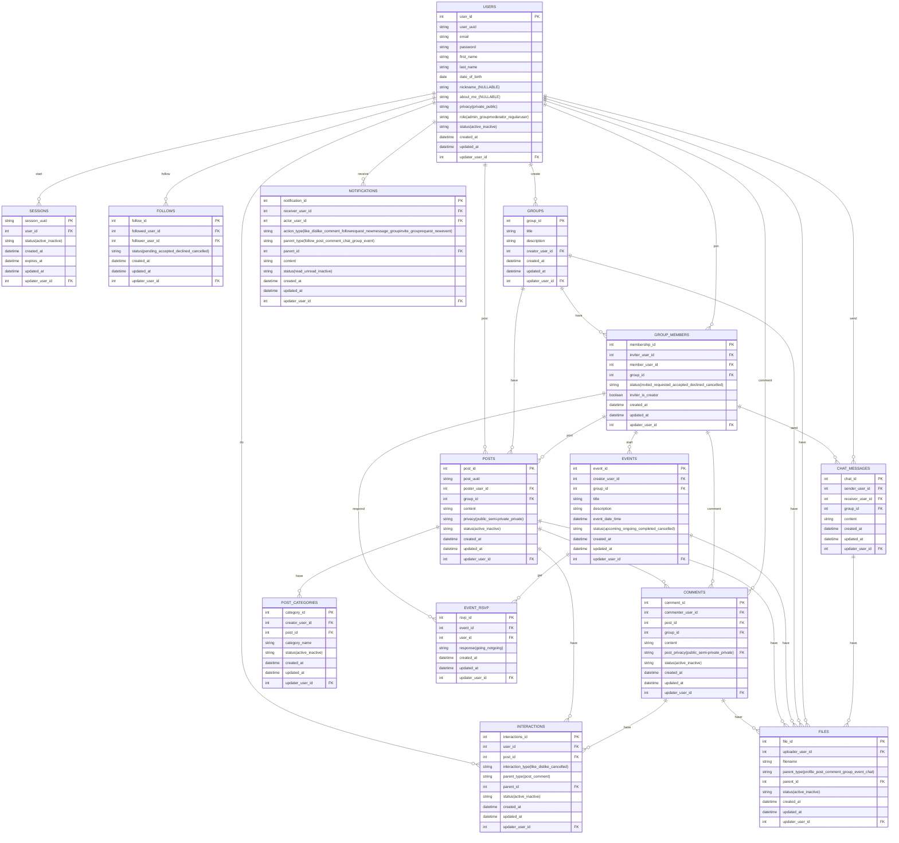

# Social Network

A Facebook-like social network application with authentication, profiles, posts, groups, notifications and chat functionality.

## Quick Start

We've included a setup script to get you up and running quickly:

```bash
# Make the setup script executable
chmod +x setup.sh

# Run the setup script
./setup.sh
```

This script will:
1. Check for required dependencies (Node.js for frontend, Go for backend)
2. Install necessary packages for both frontend and backend
3. Set up the database with migrations
4. Provide instructions for starting the applications

## Manual Setup

If you prefer to set up manually:

### Prerequisites
- Node.js (v14.0.0 or newer) - for frontend
- npm - for frontend
- Go (v1.21 or newer) - for backend
- SQLite3

### Frontend Setup
```bash
cd frontend
npm install
npm start
```

### Backend Setup
```bash
# Install Go dependencies
go mod tidy

# Start the backend server
go run main.go
```

### Database Setup
```bash
make migrateup
```

## Project Structure

- `/frontend` - React-based frontend application
- `/backend` - Go backend API server
- `/db` - SQLite database and migrations
- `main.go` - Backend entry point

## Features

- User authentication with sessions
- User profiles with privacy settings
- Posts with privacy controls
- Groups and events
- Real-time notifications
- Private and group chat
- Follower system

## Technology Stack

- **Frontend**: React, React Router, Axios
- **Backend**: Go, Gorilla Mux, SQLite3
- **Database**: SQLite with migrations
- **Authentication**: Session-based with secure cookies

## Database Schema

See the Entity-Relationship Diagram below:

### WIP: ERD


