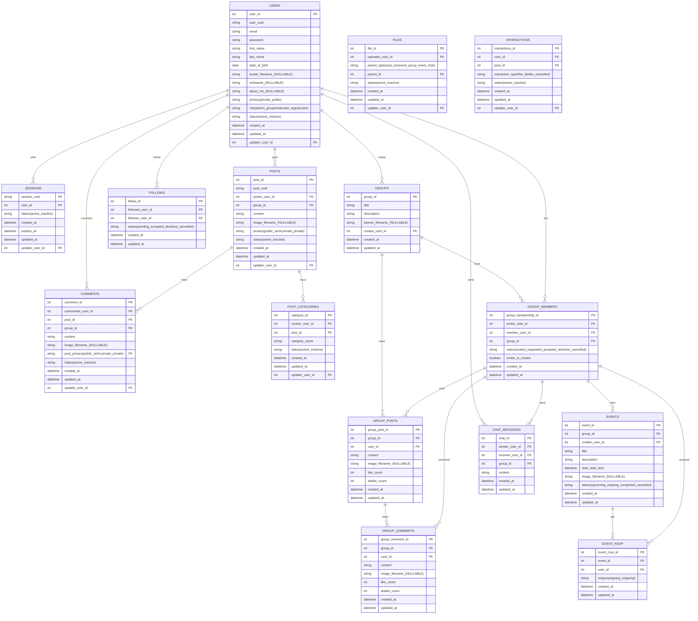

# social-network

### WIP: ERD

```mermaid
 erDiagram

    %% --- Users ---
    USERS {
        int user_id PK
        string user_uuid
        string email
        string password
        string first_name
        string last_name
        date date_of_birth
        string avatar_filename_(NULLABLE)
        string nickname_(NULLABLE)
        string about_me_(NULLABLE)
        string privacy(private_public)
        string role(admin_groupmoderator_regularuser)
        string status(active_inactive)
        datetime created_at
        datetime updated_at
        int updater_user_id FK
    }

    %% --- Sessions ---
    SESSIONS {
        string session_uuid PK
        int user_id FK
        string status(active_inactive)
        datetime created_at
        datetime expires_at
        datetime updated_at
        int updater_user_id FK
    }

    %% --- Files (Polymorphic Association: parent_id will depend on / is associated with parent_type) ---
    FILES {
        int file_id PK
        int uploader_user_id FK
        string parent_type(post_comment_group_event_chat)
        int parent_id FK
        string status(active_inactive)
        datetime created_at
        datetime updated_at
        int updater_user_id FK
    }

    %% --- Posts (group_id NULL for regular posts) ---
    POSTS {
        int post_id PK
        string post_uuid
        int poster_user_id FK
        int group_id FK
        string content
        string image_filename_(NULLABLE)
        string privacy(public_semi-private_private)
        string status(active_inactive)
        datetime created_at
        datetime updated_at
        int updater_user_id FK
    }

    %% --- Comments (group_id NULL for regular post comments) ---
    COMMENTS {
        int comment_id PK
        int commenter_user_id FK
        int post_id FK
        int group_id FK
        string content
        string image_filename_(NULLABLE)
        string post_privacy(public_semi-private_private) FK
        string status(active_inactive)
        datetime created_at
        datetime updated_at
        int updater_user_id FK
    }

    %% --- Post Categories ---
    POST_CATEGORIES {
        int category_id PK
        int creator_user_id FK
        int post_id FK
        string category_name
        string status(active_inactive)
        datetime created_at
        datetime updated_at
        int updater_user_id FK
    }

    %% --- Interactions ---
    INTERACTIONS {
        int interactions_id PK
        int user_id FK
        int post_id FK
        string interaction_type(like_dislike_cancelled)
        string status(active_inactive)
        datetime created_at
        datetime updated_at
        int updater_user_id FK
    }

    %% --- REVIEW STARTING HERE:::: Follows (if followed_user_id is public, status is auto accepted) ---
    FOLLOWS {
        int follow_id PK
        int followed_user_id FK
        int follower_user_id FK
        string status(pending_accepted_declined_cancelled)
        datetime created_at
        datetime updated_at
    }

    %% --- Groups ---
    GROUPS {
        int group_id PK
        string title
        string description
        string banner_filename_(NULLABLE)
        int creator_user_id FK
        datetime created_at
        datetime updated_at
    }

    %% --- Group Memberships ---
    GROUP_MEMBERS {
        int group_membership_id PK
        int inviter_user_id FK
        int member_user_id FK
        int group_id FK
        string status(invited_requested_accepted_declined_cancelled)
        boolean inviter_is_creator
        datetime created_at
        datetime updated_at
    }

    %% --- Group Posts ---
    GROUP_POSTS {
        int group_post_id PK
        int group_id FK
        int user_id FK
        string content
        string image_filename_(NULLABLE)
        int like_count
        int dislike_count
        datetime created_at
        datetime updated_at
    }

    %% --- Group Comments ---
    GROUP_COMMENTS {
        int group_comment_id PK
        int group_id FK
        int user_id FK
        string content
        string image_filename_(NULLABLE)
        int like_count
        int dislike_count
        datetime created_at
        datetime updated_at
    }

    %% --- Events ---
    EVENTS {
        int event_id PK
        int group_id FK
        int creator_user_id FK
        string title
        string description
        datetime start_date_time
        string image_filename_(NULLABLE)
        string status(upcoming_ongoing_completed_cancelled)
        datetime created_at
        datetime updated_at
    }

    %% --- Event Responses ---
    EVENT_RSVP {
        int event_rsvp_id PK
        int event_id FK
        int user_id FK
        string response(going_notgoing)
        datetime created_at
        datetime updated_at
    }

    %% --- Chat Messages (private chats go to receiver_user_id so group_id will be null; but group chats will reference group_id then query all members of that group, so receiver_user_id will be null) ---
    CHAT_MESSAGES {
        int chat_id PK
        int sender_user_id FK
        int receiver_user_id FK
        int group_id FK
        string content
        datetime created_at
        datetime updated_at
    }

    %% --- Relationships ---
    USERS ||--o{ SESSIONS : start
    USERS ||--o{ FOLLOWS : follow
    USERS ||--o{ POSTS : post
    USERS ||--o{ COMMENTS : comment
    POSTS ||--o{ COMMENTS : have
    POSTS ||--o{ POST_CATEGORIES : have
    USERS ||--o{ CHAT_MESSAGES : send
    GROUP_MEMBERS ||--o{ CHAT_MESSAGES : send
    USERS ||--o{ GROUPS : create
    GROUPS ||--o{ GROUP_MEMBERS : have
    USERS ||--o{ GROUP_MEMBERS : join
    GROUPS ||--o{ GROUP_POSTS : have
    GROUP_POSTS ||--o{ GROUP_COMMENTS : have
    GROUP_MEMBERS ||--o{ GROUP_POSTS : post
    EVENTS ||--o{ EVENT_RSVP : get
    GROUP_MEMBERS ||--o{ EVENT_RSVP : respond
    GROUP_MEMBERS ||--o{ GROUP_COMMENTS : comment
    GROUP_MEMBERS ||--o{ EVENTS : start

```
