# Social Network Project Flowchart

This file contains a textual representation of the current project structure using Mermaid syntax for a flowchart. You can copy and paste this into a tool like Mermaid Live Editor (https://mermaid.live/) to visualize the diagram.

## Project Structure Flowchart

```mermaid
graph TD
    A[social-network] --> B[backend]
    A --> C[frontend]
    A --> D[setup.sh]

    B --> E[db]
    B --> F[dbTools]
    B --> G[handlers]
    B --> H[middleware]
    B --> I[public]
    B --> J[utils]
    B --> K[main.go]

    E --> L[migrations/]
    E --> M[socnet.db]
    E --> N[socnet.sql]

    F --> O[dbSession.go]
    F --> P[dbStructs.go]
    F --> Q[dbUser.go]
    F --> R[dbUtils.go]

    G --> S[follows.go]
    G --> T[general.go]
    G --> U[user_auth.go]
    G --> V[posts.go]

    H --> W[cors.go]

    I --> X[uploads/]

    J --> Y[common.go]

    C --> Z[public]
    C --> AA[src]

    Z --> AB[styles/]
    AB --> AC[index.css]

    AA --> AD[api/]
    AA --> AE[contexts/]
    AA --> AF[pages/]
    AA --> AG[utils/]
    AA --> AH[App.jsx]
    AA --> AI[index.jsx]

    AD --> AJ[auth.jsx]
    AD --> AK[profile.jsx]

    AE --> AL[AuthContext.jsx]

    AF --> AM[HomePage.jsx]
    AF --> AN[LoginPage.jsx]
    AF --> AO[RegisterPage.jsx]
    AF --> AP[ProfilePage.jsx]
    AF --> AQ[ProfilePage.css]

    AG --> AR[validate.jsx]
```

## Explanation
- **social-network**: Root directory of the project.
- **backend**: Contains all server-side code including database tools, handlers, and utilities.
- **frontend**: Contains all client-side code including React components and API interactions.
- **setup.sh**: Script for project setup.
- Each subdirectory and file is represented as a node in the flowchart, showing the hierarchical structure of the project.

You can visualize this flowchart by copying the Mermaid code above into a compatible tool or editor that supports Mermaid diagrams. 